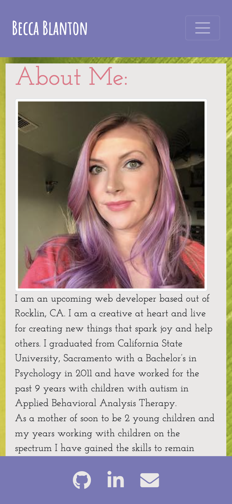
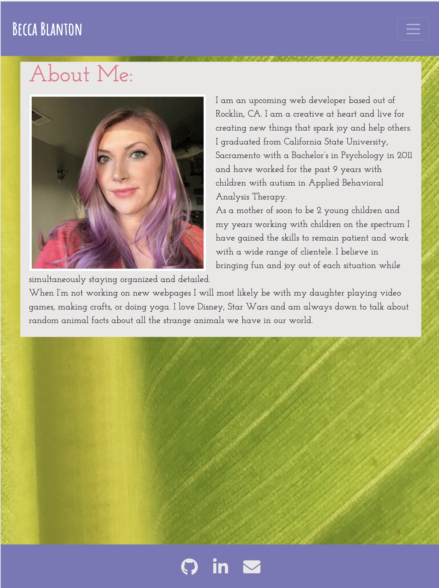
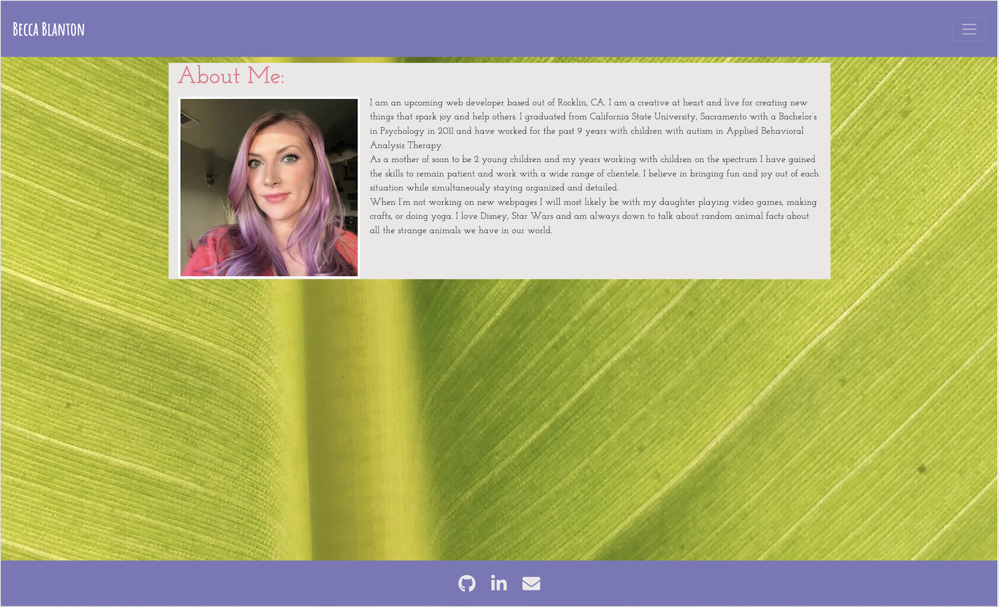
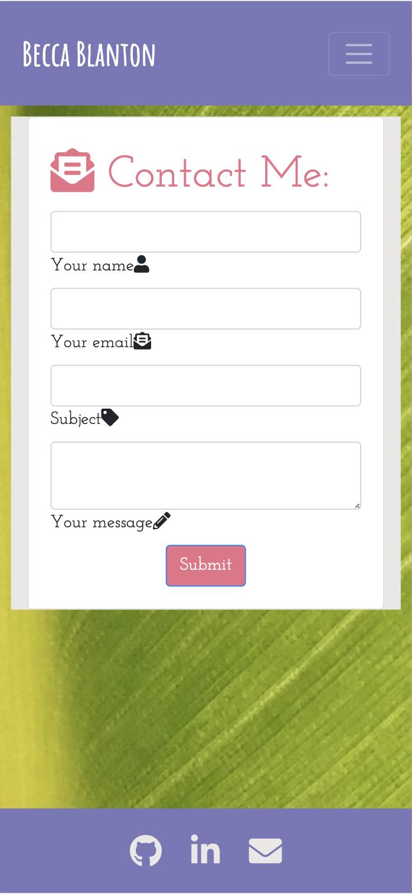
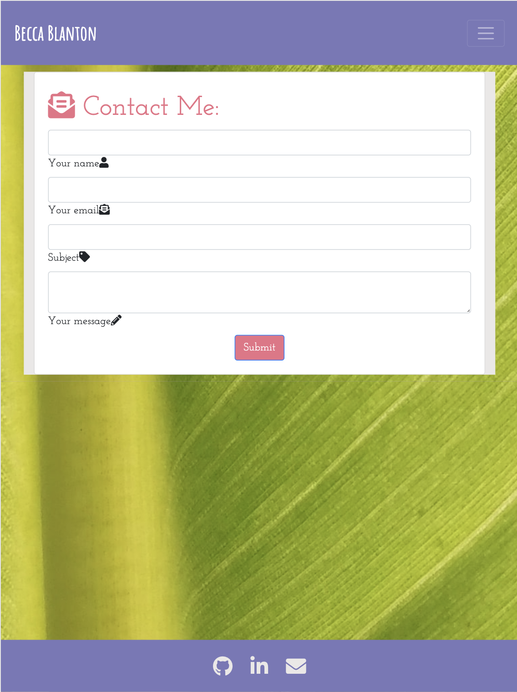
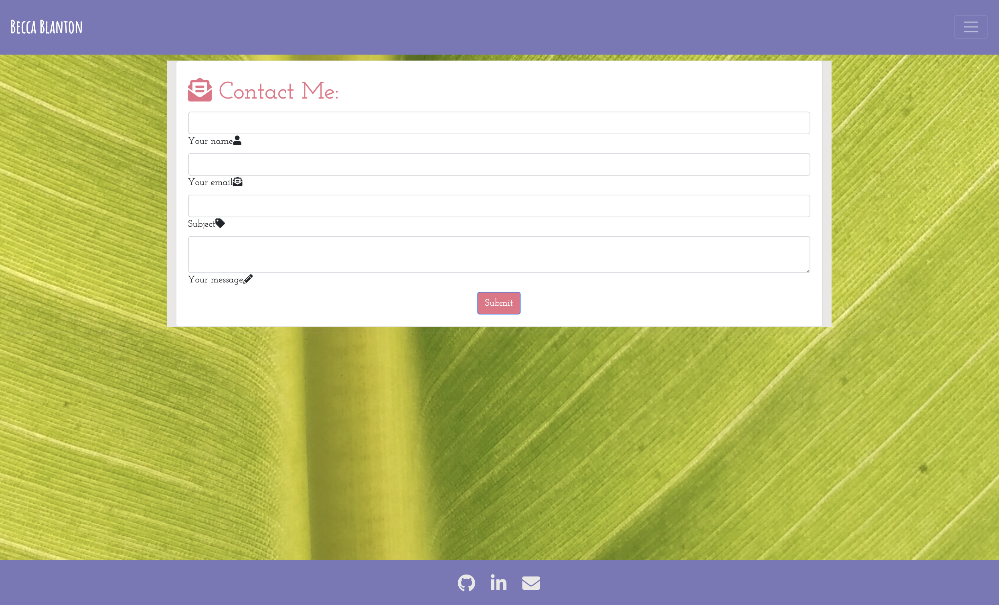
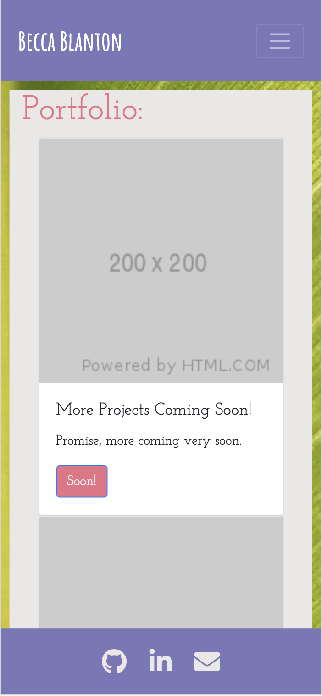
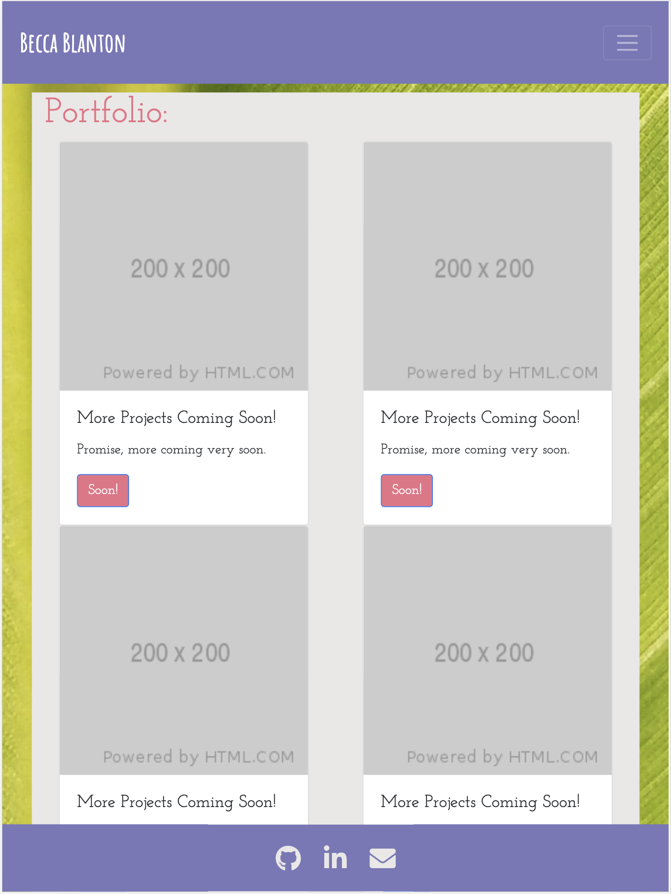
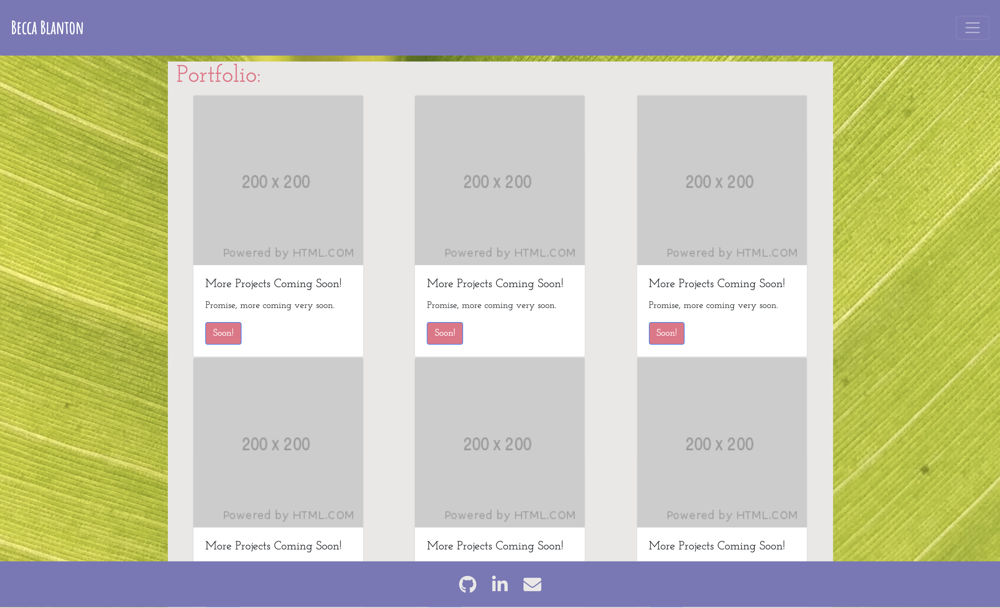

# BeccaBlanton.github.io

## Personal Webpage/About me with Links to Contact me form as well as personal Portfolio of projects I have completed.

#### Websites were built using HTML/CSS with the use of bootstrap website.

## Main/About me page:

* Designed basic About me front page including a container containing a profile picture and snippet about me. Container created through use of bootstrap.
* Created dropdown Nav bar used throughout all websites.
* Included a sticky footer across all websites.
* adjusted img to adjust depending on size of device. 
* Used google fonts to add custom fonts to page.

## Contact Page:

* Made a contact page with use of bootstrap forms to email (form not currently synced to email)
* font awesome icons used next to forms as well as labels
* responsive page to fit all media sizes
* cohesive style with main page and portfolio including nav bar and sticky footer

## Portfolio Page:
* Containers in place for future projects completed.
* used placeholders for coming soon once portfolio is built out.
* disabled buttons currently due to being placeholders. will link to future projects completed.

## Sticky Footer
* added footer to the bottom of all pages with icon links to social media sites as well as an email link.

## Resources Used:
1. Bootstrap for grid layout, nav bar, footer, forms, and portfolio: https://getbootstrap.com/
1. Font Awesome site for icosn: https://fontawesome.com/
1. Google Fonts for custom Fonts: fonts.google.com
1. Unsplash for background photo: unsplash.com
1. Graphic Mama for Website Color Schemes: graphicmana.com/blog/website-color-schemes/

## Website Examples:

